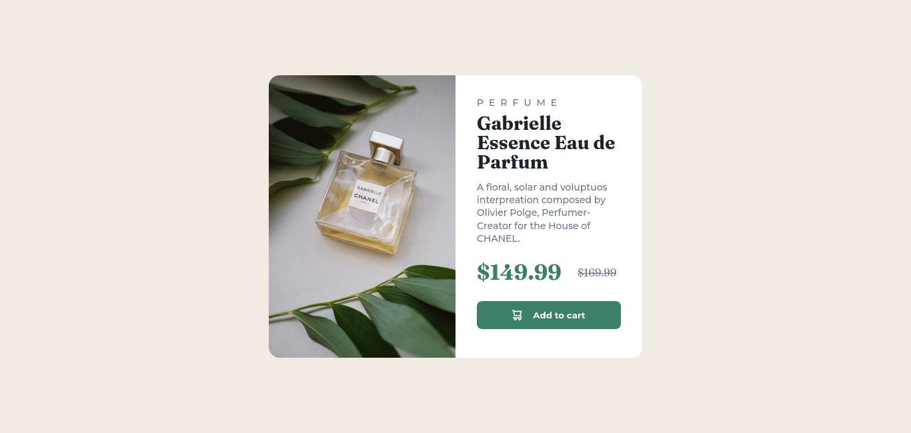
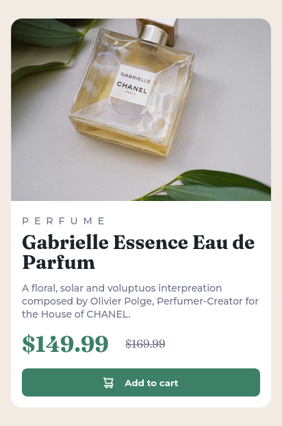

# Frontend Mentor - Product preview card component solution

This is a solution to the [Product preview card component challenge on Frontend Mentor](https://www.frontendmentor.io/challenges/product-preview-card-component-GO7UmttRfa.) Frontend Mentor challenges help you improve your coding skills by building realistic projects.

## Table of contents

- [Overview](#overview)
  - [The challenge](#the-challenge)
  - [Screenshot](#screenshot)
  - [Links](#links)
- [My process](#my-process)
  - [Built with](#built-with)
  - [What I learned](#what-i-learned)
  - [Continued development](#continued-development)
  - [Useful resources](#useful-resources)
- [Author](#author)

## Overview

### The challenge

Users should be able to:

- View the optimal layout depending on their device's screen size
- See hover and focus states for interactive elements

### Screenshot




### Links

- Solution URL: [Add solution URL here]()
- Live Site URL: [https://parfum-preview.netlify.app](https://parfum-preview.netlify.app)

## My process

### Built with

- Flexbox
- Mobile-first workflow
- [React](https://reactjs.org/) - JS library
- [Sass](https://sass-lang.com) - CSS Preprocessor
- [CSS Modules](https://github.com/css-modules/css-modules) - For styles
- [Vite](https://vite.dev) - Next Generation Frontend Tooling

### What I learned

Learned some about CSS Modules and flexbox, in particulaly, learned on how to make items stay the sime size on a flex container.

```css
.container {
  display: flexbox;
}

.child {
  flex: 1 0 50%; /* Only works for a "2 item" container */
}
```

Still don't like my HTML semantics and I'm looking to improve it.

### Continued development

Responsiveness feels good, I should probably leave at this state. Perfectionism sucks.

### Useful resources

- [Example resource 1](https://web.dev/learn/design/responsive-images) - Learned a lot about responsiveness on images.

- [Example resource 2](https://web.dev/learn/design/typography) - Another GREAT resource.

## Author

- Frontend Mentor - [@Bruno514](https://www.frontendmentor.io/profile/Bruno514)
